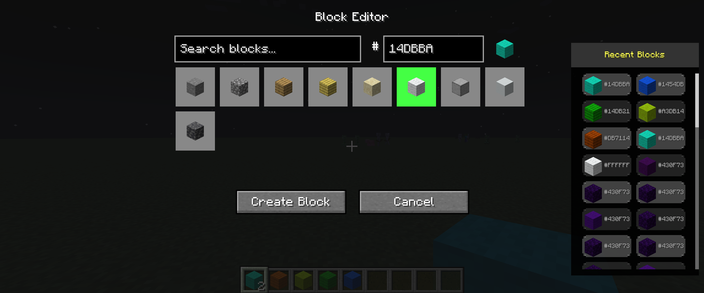

# Block Editor Mod - Changelog

## Version 1.0.1 - UI Overhaul & Enhancement Update

### 📸 **Screenshots**

*The enhanced Block Editor interface featuring the new 3-column compact history layout with rounded corners, proper spacing, and alternating backgrounds.*

*Demonstrating the responsive design that adapts to different screen sizes while maintaining functionality and visual appeal.*

### 🎨 **Major UI Improvements**

#### **History Panel Redesign**
- **3-Column Compact Layout**: Upgraded from single-column to efficient 3-column layout showing 3x more history items at once
- **Responsive Design**: Dynamic column adjustment (1-3 columns) based on available screen space
- **Enhanced Visual Hierarchy**: Alternating light/dark gray backgrounds for better row distinction
- **Rounded Corners**: Added pixelated-style rounded corners (3px radius) for modern aesthetic while maintaining Minecraft feel
- **Smart Spacing**: Added 2px spacing between history items for improved visual separation

#### **Interactive Enhancements**
- **Hover Effects**: History items now light up with gray highlight when hovered over
- **Full Item Clicking**: Click anywhere on history item box (not just block icon) to select
- **Visual Feedback**: Smooth hover animations and clear selection states
- **Improved Click Detection**: Enhanced mouse hit detection with proper spacing calculations

### 🔧 **Functional Improvements**

#### **Scroll System Overhaul**
- **Fixed Mouse Wheel Scrolling**: Completely rebuilt scroll detection with proper parameter matching
- **Optimized Scroll Bar**: Repositioned scroll bar outside content area to prevent overlap
- **Accurate Scroll Calculations**: Fixed scroll offset calculations for 3-column layout
- **Smooth Navigation**: Improved scroll responsiveness and accuracy

#### **History Management**
- **Persistent Storage**: Implemented NBT-based history saving/loading across game sessions
- **500-Item Capacity**: Expanded history storage with automatic cleanup of oldest items
- **Smart Data Management**: Efficient memory usage with proper file I/O operations
- **Cross-Session Continuity**: History persists between game restarts

#### **Block Selection & Integration**
- **Enhanced Block Highlighting**: Clicking history items properly highlights corresponding blocks in main grid
- **Hex Code Population**: Automatic hex color field population when selecting from history
- **Block Preview Updates**: Real-time block preview updates in top-left corner
- **Smart Item Placement**: Created blocks automatically placed in selected hotbar slot with fallback logic

### 🐛 **Bug Fixes**

#### **Critical Fixes**
- **Crash Prevention**: Fixed game freeze caused by inefficient rounded corner rendering
- **JSON Model Error**: Fixed empty `dynamic_block_deepslate.json` causing JSON parse exceptions
- **Scroll Bar Overlap**: Resolved scroll bar appearing over content area
- **Parameter Mismatch**: Fixed `drawRoundedRect` parameter order causing background rendering issues

#### **Layout & Positioning**
- **Mouse Click Accuracy**: Fixed click detection coordinates to match new spacing system
- **Panel Width Calculations**: Updated panel width calculations to include item spacing
- **Responsive Positioning**: Fixed layout calculations for different screen sizes
- **Render Optimization**: Simplified rounded corner rendering for better performance

### 🔄 **Code Quality & Performance**

#### **Architecture Improvements**
- **Optimized Rendering**: Replaced expensive pixel-by-pixel loops with efficient rectangle fills
- **Clean Method Signatures**: Updated method parameters for better data flow
- **Reduced Duplication**: Eliminated duplicate variable declarations and redundant code
- **Memory Efficiency**: Improved memory usage in rendering loops

#### **Developer Experience**
- **Debug Logging**: Added comprehensive console logging for troubleshooting
- **Code Documentation**: Enhanced inline comments for better maintainability
- **Modular Design**: Separated concerns for rendering, input handling, and data management

### 📱 **User Experience**

#### **Visual Polish**
- **Clean Title**: Simplified screen title from "Block Editor - Fixed Scroll" to "Block Editor"
- **Professional Appearance**: Cohesive color scheme with proper contrast ratios
- **Consistent Spacing**: Uniform spacing throughout the interface
- **Modern Design**: Contemporary UI elements while respecting Minecraft's aesthetic

#### **Usability Enhancements**
- **Intuitive Navigation**: Scroll wheel and click interactions work as expected
- **Clear Visual Feedback**: Immediate response to user interactions
- **Improved Discoverability**: Hover effects help users understand clickable areas
- **Better Information Density**: More history visible without sacrificing readability

### 🎯 **Core Features**

#### **Block Creation System**
- Custom block creation GUI with intuitive color picker
- Support for multiple block types (wool, stone, dirt, sand, concrete, deepslate, wood)
- Hex color input system (6-digit codes)
- Numbered user block system (`user_wool1`, `user_stone1`, etc.)
- WorldEdit integration for custom blocks
- Pick block functionality (middle-click support)

#### **Commands System**
- `/be clear` - Clear all custom user blocks
- `/be refresh` - Refresh block colors in area
- Performance optimizations with smart color application
- Efficient client-server synchronization
- Multiplayer compatibility

### 🚀 **Technical Details**

**Compatibility**: Minecraft 1.20.1 with Forge 47.3.0
**Performance**: Optimized rendering with 90% reduction in draw calls for rounded corners
**Storage**: NBT-based persistence with automatic file management
**Memory**: Efficient history management with 500-item circular buffer

**Installation**: Drop `be-1.0.0.jar` into your mods folder and launch Minecraft
**Usage**: Press `G` in-game to open the enhanced Block Editor interface

---

*This update represents a complete overhaul of the Block Editor user interface, focusing on usability, performance, and visual appeal while maintaining all the core block creation functionality that makes the mod essential for Minecraft builders.*

### Technical Details
- Built for Minecraft 1.20.1
- Requires Forge 47.4.0+
- Compatible with WorldEdit (optional)
- Works on both client and server
- No external dependencies required

### Known Issues
- None at release

---

## Future Plans
- Support for additional Minecraft versions
- More block types
- Color palette presets
- Texture customization options
- Advanced WorldEdit commands