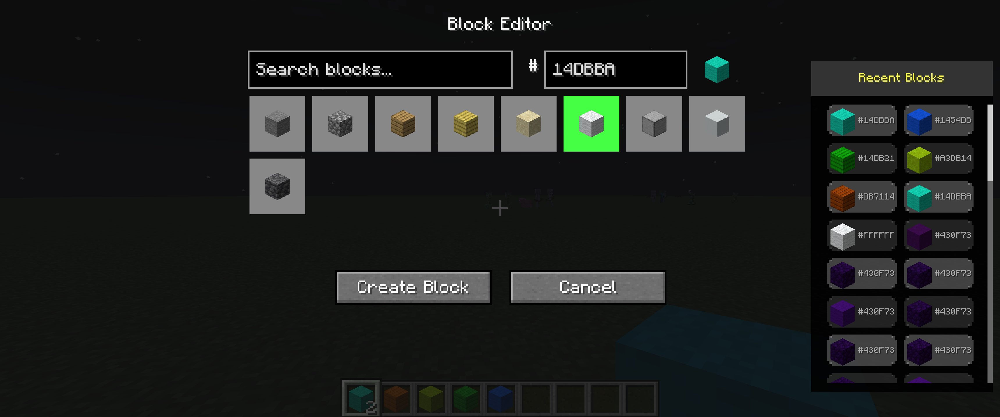
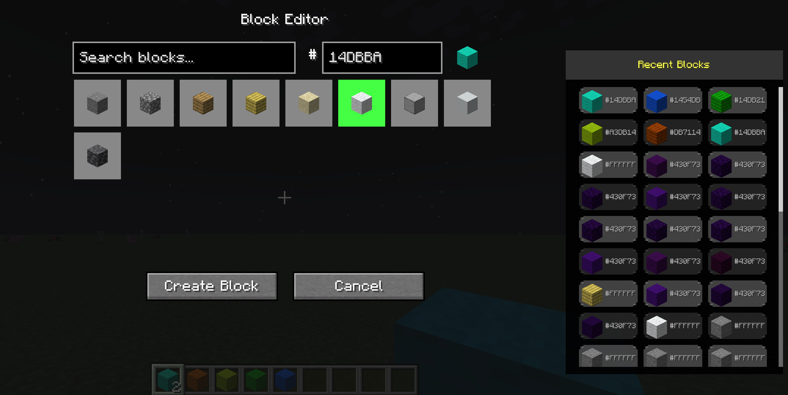

# BlockEditor - Custom Block Creator

[](https://minecraft.net/)
[](https://files.minecraftforge.net/)
[](LICENSE)

Create and customize blocks with any color and texture in Minecraft!

## ✨ Features

- 🎨 **Custom Block Creation**: Intuitive GUI-based block editor with color picker
- 🧱 **Multiple Block Types**: Supports wool, stone, dirt, sand, concrete, deepslate, wood, and more
- 🔧 **WorldEdit Integration**: Use custom blocks seamlessly in WorldEdit commands
- 📝 **Numbered User Blocks**: Easy-to-use system (`user_wool1`, `user_stone1`, etc.)
- ⚡ **Performance Optimized**: Efficient color application and world persistence
- 🎮 **Pick Block Support**: Middle-click to get custom blocks in creative mode
- 💾 **Persistent Storage**: Custom blocks saved across world restarts
- 🌐 **Multiplayer Compatible**: Works on both single-player and dedicated servers

## 🌈 Unlimited Color & Texture Combinations

What sets BlockEditor apart from other block mods is its **massive variety** of combinations:

### 🎨 **16.7 Million Colors × 9 Textures = 150+ Million Unique Blocks**
- **Full RGB Spectrum**: Any hex color from `#000000` to `#FFFFFF` (16,777,216 colors) via color picker
- **9 Base Textures**: Wool, Stone, Dirt, Sand, Concrete, Deepslate, Wood, Smooth Stone, and Cobblestone
- **Smart Storage**: 20 user slots per texture (180 total) for your favorite combinations with persistent storage

### 🔥 **Why This Matters**
- **Unlimited Color Potential**: Full 16.7 million color RGB spectrum vs typical mods with 16-64 fixed blocks
- **Perfect Color Matching**: Match any build palette, artwork, or design specification exactly
- **Practical Storage**: 180 persistent user slots for your most-used color combinations
- **Texture Variety**: Same color looks completely different on wool vs stone vs concrete

### 💡 **Real-World Examples**
```
Crimson Red (#DC143C):
- On Wool: Soft fabric appearance
- On Stone: Bold architectural accent  
- On Concrete: Modern industrial look
- On Wood: Rich mahogany effect

Ocean Blue (#006994):
- On Wool: Cozy interior fabric
- On Deepslate: Deep cave atmosphere
- On Concrete: Contemporary exterior
- On Sand: Tropical beach vibes
```

**Result**: Whether you're building pixel art, modern architecture, medieval castles, or abstract sculptures, BlockEditor has the exact color-texture combination you need.

## � Screenshots


*Enhanced Block Editor interface featuring the new 3-column compact history layout with rounded corners, proper spacing, and alternating backgrounds.*


*Responsive design that adapts to different screen sizes while maintaining functionality and visual appeal.*

## �🚀 Installation

1. **Download** the latest release from [Releases](../../releases)
2. **Install** Minecraft Forge 47.4.0+ for Minecraft 1.20.1
3. **Place** the `.jar` file in your `mods` folder
4. **Launch** Minecraft with the Forge profile

## 🎮 Usage

### Basic Block Creation
1. Press **G** (default keybind) to open the Block Editor GUI
2. Select your desired base block type from the grid
3. Enter a custom hex color code (e.g., `FF0000` for red) or use the default
4. Click **"Create Block"** to add it to your inventory
5. Place the block in your world - it will automatically apply your custom color!

### WorldEdit Integration
Use your custom blocks in any WorldEdit command:
```
//set blockeditor:user_wool1
//replace stone blockeditor:user_stone1
//walls blockeditor:user_concrete1
```

### Commands
- `/be clear` - Clear all custom user blocks from the world
- `/be refresh` - Refresh custom block colors in a 16-block radius

## 🎨 Color System

- **Hex Colors**: Enter any 6-digit hex color code (without #)
- **Pre-made Blocks**: Over 30 pre-colored block variants available
- **Numbered System**: Blocks are automatically assigned numbers (`user_wool1`, `user_wool2`, etc.)
- **Persistence**: Colors are saved and persist across world reloads

## 🔧 Technical Details

- **Minecraft Version**: 1.20.1
- **Mod Loader**: Forge 47.4.0+
- **Side**: Both Client and Server
- **Dependencies**: None (optional WorldEdit integration)

## 📋 Version History

### v1.0.0
- Initial release
- Full block customization system
- WorldEdit integration
- Performance optimizations
- Multiplayer support

## 🤝 Contributing

Contributions are welcome! Please feel free to submit issues or pull requests.

## 📄 License

This project is licensed under the MIT License - see the [LICENSE](LICENSE) file for details.

## 🙏 Acknowledgments

- Built for Minecraft 1.20.1 with Forge
- Compatible with WorldEdit for enhanced building
- Inspired by the need for better block customization tools

---

**Made with ❤️ for the Minecraft modding community**